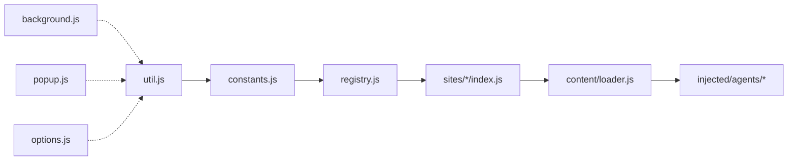

# 深学助手 ARCHITECTURE

本文件为项目的单一信息源（SSOT）级架构文档，聚焦“做什么、为什么、如何协同”。实现细节与逐行代码解释请参考源码本身与注释。

---

## 项目概述

深学助手是一个基于 Chrome 扩展 API v3 的在线学习提效工具。面向多学习平台（目前覆盖 0755TT、SmartEdu 系列），提供：
- 视频自动化与稳定播放
- 章节测试/考试的辅助自动化
- 统一的站点注册与选择器适配

目标：稳定、可扩展、易维护，最小化权限与站点入侵，最大化对前端变化的适应力。

---

## 架构总览

### 分层模型

1) 扩展核心层：Background(Service Worker) / Popup / Options  
2) 功能抽象层：工具库(util) / 常量(constants) / 站点注册(registry) / 平台配置(platforms)  
3) 站点适配层：各平台模块（0755TT、SmartEdu...）  
4) 运行环境层：Content Script（沙箱）与 Page Injection（主世界）按需协作

### 模块结构图

### 通信与执行时序

- Options ↔ StorageSync：用户启用/禁用各站点
- Content Script(loader) → Registry：解析当前 URL 匹配站点模块并启动
- Content Script ↔ Injected Agent：仅当需要主世界能力（如深度控制考试/视频）时，通过消息桥接通信
- Background（可选）↔ 调试/注入：在需要时使用 chrome.debugger 执行注入

---

## 核心模块职责

### content/loader.js（沙箱环境）
- 启动入口：在匹配页面中解析站点、读取启用配置、初始化模块
- 权限最小化：仅在需要的域名注入，隔离于页面 JavaScript
- 出错隔离：单站点失败不影响其他站点

### injected/*（页面主世界，按需）
- exam-agent.js：在考试/深度集成场景进行主世界控制
- message-bridge.js：跨环境消息桥接与安全校验

### src/*（抽象能力）
- util.js：DOM 与交互工具、存储、日志、性能计时
- registry.js：站点注册/解析，驱动 sites/* 模块
- platforms.js / config：平台级通用配置

### sites/*（站点适配）
- 0755tt：`video.js`、`exam.js`、`questionBank.js` 等
- smartedu：站点差异化适配

---

## 运行时架构选择

- Content Script 优先：更安全、权限更低、对页面入侵更小
- Page Injection 兜底：当且仅当需要访问页面运行时（Vue 实例、网络拦截等）才启用注入
- 策略切换：依据稳定性与用户反馈在架构之间进行迭代（详见 CHANGELOG）

---

## 冗余清理（2025-09）

- 后端 API：
  - 新增 `api/db.js` 复用 `api/admin/middleware.js` 中的连接池与 `JWT_SECRET`，普通用户 API 不再各自创建连接池。
  - 新增 `api/cors.js` 复用管理员 CORS 实现，`api/login.js`、`api/register.js`、`api/verify.js` 统一调用，删除手写 CORS 头部。
- 前端管理台：
  - 抽取 `admin-panel/hooks/usePaginatedData.js` 统一分页/筛选/加载逻辑。
  - 抽取 `admin-panel/components/Pagination.jsx` 统一分页组件，替换 Users/Invitations 页面的重复分页 JSX。
- 数据库脚本：
  - 删除 `scripts/create-tables.js`（与 `database/init.sql` 职责重叠）。保留 `scripts/migrate.js` 作为从 `init.sql` 执行的统一入口。

## 安全与权限

- 权限最小化：仅声明 `storage`、必要的 host 权限；需要时才启用 `debugger`
- 环境隔离：默认在 content script 运行，与页面 JavaScript 隔离
- 消息校验：严格校验来源域名、消息签名与数据结构
- 失败兜底：超时保护、重复补丁保护、异常隔离

---

## 开发与部署

- 开发构建：`npm run build` 生成 `dist/`
- 生产打包：`npm run pack` 生成可安装包
- 测试运行：`npm run test`
- 详情参考：`DEPLOYMENT.md`

---

## 扩展新平台指引（速览）

1) 在 `src/sites/<platform>/` 新建模块：`index.js`、`video.js`、`exam.js`（按需）
2) 在 `src/registry.js` 注册站点解析逻辑（或通过统一注册入口）
3) 根据需要选择运行环境：优先 content script；如需主世界访问再集成 injected agent
4) 在 `options/` 页面（存储 `enabledSites`）添加新站点的控制开关
5) 在 `manifest.*.json` 与平台配置中声明 host 权限与注入顺序

---

## 质量与可维护性

- 代码风格：ESLint + Prettier 配置生效
- 可测试性：util/registry 等核心模块具备良好可测性
- 可观测性：日志前缀标准化，必要时集成 Sentry 上报

---

## 关联文档

- CHANGELOG：`CHANGELOG.md`
- 部署指南：`DEPLOYMENT.md`
- 安全清单：`SECURITY_CHECKLIST.md`
