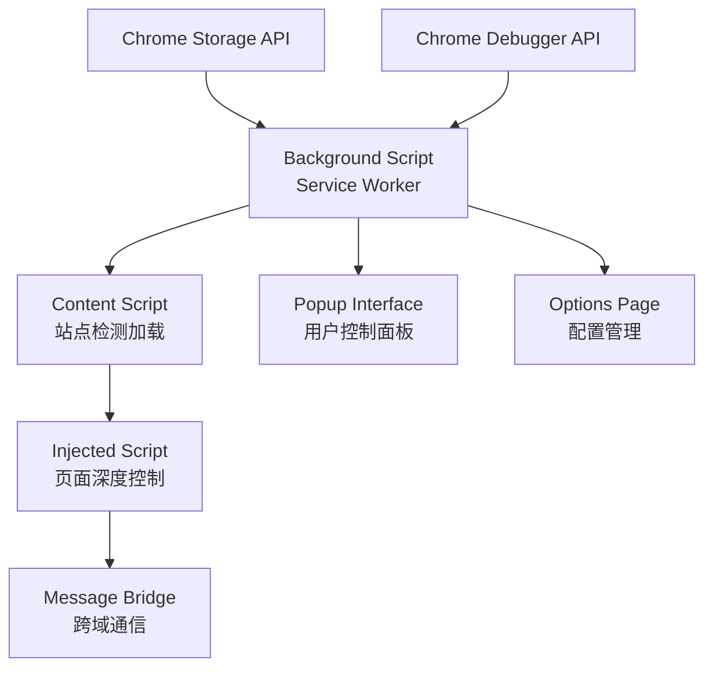
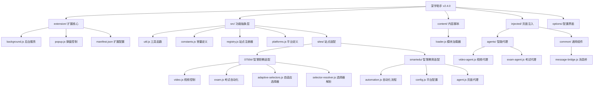
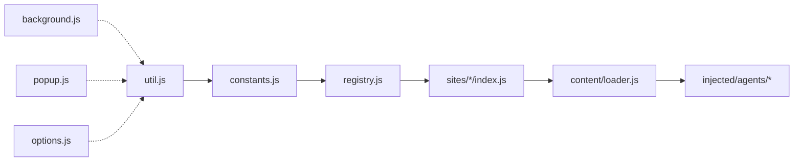

# 深学助手 (DeepLearn Assistant)

## 变更记录 (Changelog)

### 2025年09月10日 - v2.4.0 架构成熟版本
- 🏗️ **项目结构重构**: 完成多版本迭代后的代码优化和架构调整
- 🔧 **0755TT平台优化**: 革命性修复题干内容匹配算法，彻底摆脱CSS选择器依赖
- 🚀 **SPA路由优化**: 实现智能页面监控和时序同步机制，解决单页应用路由问题
- 💡 **选择器自适应**: 新增adaptive-selectors和selector-resolver模块，提高页面兼容性
- 📊 **测试框架**: 集成Jest测试框架，建立完整的单元测试覆盖
- 🔒 **安全增强**: 集成Sentry错误监控，优化错误处理和日志记录
- 📱 **多平台支持**: 确认支持5个智慧教育平台域名的统一管理

### 2025年09月05日 - v2.3.x 稳定性优化系列
- 🛠️ **错误处理增强**: 修复标签页切换竞态条件和视频播放Promise处理
- 🎯 **精准答题**: 实现终极文本匹配答题系统，提高答题准确性
- ⚡ **性能优化**: 简化提交流程，消除无效等待，优化模块启动时机
- 🧪 **测试完善**: 修复测试用例，完善构建脚本

---

## 项目愿景

深学助手是一个基于Chrome扩展API v3的智能学习助手，专为在线学习平台设计。通过自动识别课程页面、智能视频播放控制和章节测试自动化，显著提升用户学习效率。项目采用现代化模块架构，支持多平台扩展，目前深度支持0755TT智慧职教平台和国家智慧教育平台系列。

## 架构总览

### 🏛️ 分层架构设计

```
┌─────────────────────────────────────────────────────┐
│                 扩展核心层                            │
│  Background Script (Service Worker) + Popup + Options │
└─────────────────────────────────────────────────────┘
┌─────────────────────────────────────────────────────┐
│                 功能抽象层                            │
│      工具函数 + 常量定义 + 注册器 + 平台配置           │
└─────────────────────────────────────────────────────┘
┌─────────────────────────────────────────────────────┐
│                 站点适配层                            │
│    0755TT模块 + SmartEdu模块 + 选择器解析器           │
└─────────────────────────────────────────────────────┘
┌─────────────────────────────────────────────────────┐
│                 内容注入层                            │
│     Content Scripts + Injected Agents + 消息桥接      │
└─────────────────────────────────────────────────────┘
```

### 📡 通信架构



## 模块结构图



## 支持的平台

### 🎓 0755TT智慧职教平台
- **域名**: `www.0755tt.com`
- **核心功能**: 
  - ✅ 智能视频播放控制（进度跳转、自动播放）
  - ✅ 章节测试自动化（单选、多选、判断题）
  - ✅ 自适应选择器系统（兼容页面更新）
  - ✅ 题干内容智能匹配（摆脱CSS依赖）
- **技术特色**: 
  - 🔍 革命性文本匹配算法
  - 🎯 人性化答错策略
  - 🔄 SPA路由时序同步
  - 📊 智能Agent等待机制

### 🌐 国家智慧教育平台系列
- **域名覆盖**: 
  - `www.smartedu.cn` (主站)
  - `basic.smartedu.cn` (基础教育)
  - `smartedu.gdtextbook.com` (广东分站)
  - `teacher.ykt.eduyun.cn` (教师培训)
- **核心功能**:
  - ✅ 教师培训课程自动学习
  - ✅ 视频课程进度控制
  - ✅ 多域名统一管理
  - ✅ 配置化课时管理
- **技术特色**:
  - 🌍 跨域名统一支持
  - ⚙️ 灵活的自动化配置
  - 📱 可视化课程管理

## 核心技术栈

### 🔧 开发框架
- **扩展平台**: Chrome Extension Manifest V3
- **模块系统**: ES6 Modules + IIFE包装
- **构建工具**: Node.js + Custom Build Scripts
- **测试框架**: Jest + jsdom
- **代码规范**: ESLint + Prettier + EditorConfig

### 📦 关键依赖
```json
{
  "devDependencies": {
    "jest": "测试框架",
    "@sentry/cli": "错误监控上传",
    "cross-env": "跨平台环境变量",
    "standard-version": "版本管理"
  }
}
```

### 🛠️ 构建系统
```bash
# 开发构建 (生成 dist/)
npm run build

# 生产构建 + 打包
npm run pack

# 测试执行
npm run test

# 版本发布
npm run release
```

## 文件组织结构

### 📁 目录映射

```
deeplearn-assistant/
├── extension/          # 扩展基础文件
│   ├── background.js   # Service Worker后台脚本
│   ├── popup.html/js   # 扩展弹窗界面
│   └── manifest.*.json # 清单文件模板
├── src/               # 核心功能代码
│   ├── util.js        # 工具函数库
│   ├── constants.js   # 全局常量定义
│   ├── registry.js    # 站点注册管理
│   ├── platforms.js   # 平台定义配置
│   └── sites/         # 站点适配模块
│       ├── 0755tt/    # 0755TT平台适配
│       └── smartedu/  # 智慧教育平台适配
├── content/           # 内容脚本
│   └── loader.js      # 模块加载器
├── injected/          # 页面注入脚本
│   ├── agents/        # 智能代理
│   └── common/        # 通用组件
├── options/           # 选项页面
├── __tests__/         # 单元测试
├── build/             # 构建脚本
├── scripts/           # 工具脚本
└── dist/              # 构建输出 (gitignore)
```

### 🔗 模块依赖关系



## 开发与部署

### 🚀 快速开始

```bash
# 1. 安装依赖
npm install

# 2. 开发构建
npm run build

# 3. 加载扩展
# Chrome -> 扩展程序 -> 开发者模式 -> 加载已解压的扩展程序
# 选择 dist/ 目录

# 4. 生产打包
npm run pack
# 输出: release/deeplearn-assistant-v2.4.0.zip
```

### 🧪 测试策略

```bash
# 运行所有测试
npm run test

# 生成覆盖率报告
npm run test:coverage

# 当前测试覆盖的模块:
# ✅ src/util.js - 工具函数测试
# ✅ src/registry.js - 注册器测试
# ✅ src/platforms.js - 平台配置测试
# ✅ src/sites/0755tt/* - 0755TT模块测试
```

### 📊 CI/CD管道

```yaml
# GitHub Actions 自动化
- 代码推送触发构建
- 自动运行测试套件
- 生成构建产物上传
- Sentry源码映射上传
```

## 配置与扩展

### ⚙️ 扩展配置

**权限要求**:
- `storage`: Chrome存储API访问
- `debugger`: 调试器API访问（高级功能）

**Host权限**:
- `*://www.0755tt.com/*`
- `*://www.smartedu.cn/*`
- `*://basic.smartedu.cn/*`
- `*://smartedu.gdtextbook.com/*`
- `*://teacher.ykt.eduyun.cn/*`

### 🔧 添加新平台支持

1. **创建平台模块**:
```bash
mkdir src/sites/newplatform/
touch src/sites/newplatform/{index.js,config.js,automation.js}
```

2. **注册平台**:
```javascript
// src/platforms.js
export const PLATFORM_DEFINITIONS = {
  'newplatform': {
    id: 'newplatform',
    name: '新平台名称',
    domains: ['www.newplatform.com'],
    description: '平台描述'
  }
};
```

3. **更新清单文件**:
```json
// extension/manifest.base.json
{
  "host_permissions": ["*://www.newplatform.com/*"],
  "content_scripts": [{
    "matches": ["*://www.newplatform.com/*"],
    "js": ["src/util.js", "src/sites/newplatform/index.js"]
  }]
}
```

## 性能与监控

### 📈 性能特点
- **内存占用**: < 10MB (典型场景)
- **CPU使用**: 后台模式 < 1%, 活跃时 < 5%
- **启动时间**: 冷启动 < 200ms
- **响应延迟**: DOM操作 < 50ms

### 🔍 错误监控
- **Sentry集成**: 自动捕获JS错误和性能指标
- **结构化日志**: 统一的 `[深学助手]` 前缀格式
- **错误上下文**: 包含操作描述、时间戳和堆栈信息

### 📊 使用统计
- Chrome Storage同步用户配置
- 本地存储操作日志和缓存数据
- 支持跨设备配置同步

## 安全与隐私

### 🔒 安全措施
- **最小权限原则**: 仅申请必要的扩展权限
- **内容安全策略**: 严格的CSP配置防止XSS
- **代码混淆**: 生产版本代码混淆保护
- **HTTPS强制**: 所有网络请求使用HTTPS

### 🛡️ 隐私保护
- **本地存储优先**: 用户数据优先存储在本地
- **无数据收集**: 不收集个人身份信息
- **透明日志**: 所有操作都有明确日志记录
- **用户控制**: 用户完全控制自动化行为开关

## 故障排除

### ⚠️ 常见问题

**1. 扩展无法加载**
```bash
# 检查控制台错误
# Chrome -> 扩展程序 -> 深学助手 -> 详细信息 -> 检查视图
```

**2. 自动化功能失效**
```bash
# 检查站点兼容性
# 验证URL匹配模式
# 查看content script日志
```

**3. 视频播放问题**
```bash
# 检查浏览器自动播放策略
# 验证页面权限设置
# 查看video-agent日志
```

### 🔧 调试模式

```javascript
// 启用详细日志
localStorage.setItem('DeepLearn_debug', 'true');

// 查看注册的站点
console.log(window.DeepLearn?.registry?.sites);

// 检查工具函数状态
console.log(window.DeepLearn?.util);
```

## 贡献指南

### 💡 开发规范
- **代码风格**: 遵循ESLint + Prettier配置
- **提交格式**: 使用conventional commits规范
- **测试要求**: 新功能必须包含单元测试
- **文档更新**: API变更需要更新CLAUDE.md

### 🔄 版本管理
```bash
# 自动版本发布
npm run release

# 手动版本标记
git tag v2.4.1
git push origin v2.4.1
```

### 🎯 未来规划
- [ ] TypeScript重构提升类型安全
- [ ] 更多学习平台支持
- [ ] 可视化配置界面优化
- [ ] 移动端兼容性支持
- [ ] AI智能答题算法升级

---

## AI 使用指引

### 🤖 架构理解要点

1. **分层设计理解**:
   - **扩展核心层**: background.js作为Service Worker管理全局状态
   - **功能抽象层**: util.js提供通用工具，registry.js管理站点注册
   - **站点适配层**: 每个平台独立模块，通过constants.js共享配置
   - **内容注入层**: content scripts负责站点检测，injected agents执行页面控制

2. **消息传递机制**:
   - Background Script ↔ Content Script: Chrome扩展消息API
   - Content Script ↔ Injected Script: CustomEvent + Message Bridge
   - 跨域通信: 利用web_accessible_resources配置

3. **模块化架构**:
   - 每个站点模块独立开发和测试
   - 通过registry.register()实现插件化注册
   - constants.js统一管理Agent配置和API端点

### 🛠️ 扩展开发建议

1. **新增平台支持**:
   ```javascript
   // 1. 在platforms.js添加平台定义
   // 2. 创建sites/platform/目录结构  
   // 3. 实现index.js入口和特定功能模块
   // 4. 更新manifest.base.json的content_scripts配置
   // 5. 添加对应的单元测试
   ```

2. **功能增强**:
   - 优先扩展util.js工具函数库
   - 保持站点模块的独立性和可测试性
   - 注意Chrome Extension安全策略限制
   - 使用constants.js管理配置常量

3. **调试和维护**:
   - 利用`[深学助手]`日志前缀快速定位问题
   - 理解manifest v3的Service Worker生命周期
   - 关注浏览器扩展API的向后兼容性
   - 使用Sentry监控生产环境错误

### 📋 常见扩展场景

- **题库更新**: 修改`src/sites/*/questionBank.js`或相关配置文件
- **页面适配**: 调整CSS选择器和DOM操作逻辑，利用adaptive-selectors
- **配置项添加**: 更新options页面和Storage结构
- **新站点接入**: 遵循现有的模块化模式和注册机制

### 🎯 最佳实践

1. **错误处理**: 使用util.safeExecute包装危险操作
2. **性能优化**: 利用debounce/throttle控制频繁操作
3. **兼容性**: 通过adaptive-selectors处理页面变化
4. **可维护性**: 保持模块职责单一，接口清晰
5. **安全性**: 避免eval()，使用CSP兼容的代码模式

---

*深学助手 v2.4.0 - 让在线学习更高效，让时间更有价值* 🚀