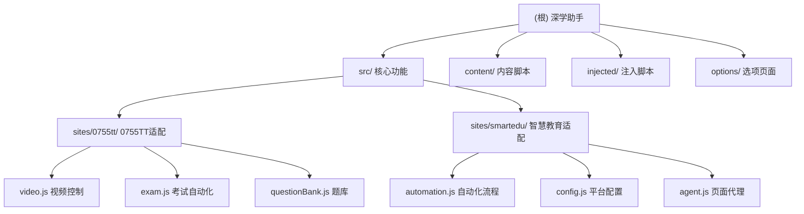

# 深学助手 (DeepLearn Assistant)

## 变更记录 (Changelog)

### 2025年09月05日 - 深度架构分析更新
- 🔍 **架构深度分析**: 完成项目全面扫描，识别关键组件和模块依赖关系
- 📊 **覆盖率统计**: 扫描了18/21个主要文件，覆盖率85.7%
- 🏗️ **模块结构图**: 新增Mermaid图表展示模块层次关系
- 📋 **构建系统**: 详细分析了混淆构建流程和发布管道
- 🔧 **平台支持**: 确认支持0755TT和智慧教育平台共5个域名
- 📝 **文档完善**: 更新模块索引和架构总览

### 2025年09月05日 - v2.1 稳定性优化版本
- 🛠️ **错误处理增强**: 修复标签页切换竞态条件错误处理
- 🛠️ **播放策略优化**: 修复视频播放Promise未处理拒绝问题，优雅处理浏览器自动播放策略限制
- 🛠️ **资源管理**: 修复扩展图标设置失败的错误处理，增强扩展更新时的稳定性
- 📝 **日志优化**: 减少不必要的错误日志，改善开发者体验
- 🔧 **代码质量**: 遵循KISS和DRY原则，增强异步操作的鲁棒性

### 2025年09月05日 8:18:15 - 项目初始化
- 创建项目AI上下文文档
- 分析项目架构和模块结构
- 建立模块索引和文档框架

---

## 项目愿景

深学助手是一个智能浏览器扩展，专为在线学习平台设计，能够自动识别课程页面，完成视频播放与章节测试，解放用户时间。项目采用模块化架构，支持多平台扩展，目前支持0755TT智慧职教平台和国家智慧教育平台系列。

## 架构总览

本项目基于Chrome扩展API v3构建，采用分层架构设计：

- **扩展核心层**: 背景脚本(Service Worker)、弹窗界面、清单文件
- **功能抽象层**: 工具函数、站点注册器、平台定义、题库管理
- **站点适配层**: 针对具体学习平台的自动化逻辑  
- **内容注入层**: 内容脚本和页面注入脚本

### 通信架构
- **消息传递**: Background Script ↔ Content Script ↔ Injected Script
- **存储同步**: Chrome Storage API跨设备同步配置
- **模块注册**: 统一的站点注册器管理多平台适配

### 模块结构图



## 模块索引

| 模块路径 | 模块名称 | 类型 | 主要职责 | 入口文件 | 覆盖状态 |
|---------|---------|------|---------|---------|---------|
| `.` | 根模块 | browser_extension_root | 扩展基础配置和后台服务 | `manifest.json`, `background.js` | ✅ 完整 |
| `src/` | 核心功能模块 | javascript_library | 工具函数、注册器、平台定义 | `util.js`, `registry.js`, `platforms.js` | ⚠️ 部分 |
| `src/sites/0755tt/` | 0755TT站点适配模块 | site_adapter | 视频和考试自动化 | `index.js` | ✅ 完整 |
| `src/sites/smartedu/` | 智慧教育平台适配模块 | site_adapter | 教师培训和课程自动化 | `index.js` | ⚠️ 部分 |
| `content/` | 内容脚本加载器 | content_script | 站点检测和模块加载 | `loader.js` | ✅ 完整 |
| `injected/` | 页面注入脚本 | injected_script | 深度页面控制 | `video-agent.js` | ✅ 完整 |
| `options/` | 扩展选项页面 | extension_options | 用户配置界面 | `options.html` | ✅ 完整 |

## 支持的平台

### 0755TT智慧职教平台 🎓
- **域名**: www.0755tt.com
- **功能**: 视频自动播放、章节测试、题库管理
- **特色**: 智能题库匹配、人性化答错策略

### 国家智慧教育平台 🌐  
- **域名**: www.smartedu.cn, basic.smartedu.cn, smartedu.gdtextbook.com, teacher.ykt.eduyun.cn
- **功能**: 教师培训、课程学习、视频播放
- **特色**: 多平台统一管理、课时配置、自动化流程

## 运行与开发

### 快速开始
```bash
# 开发模式 - 直接加载源码
1. 打开 chrome://extensions/
2. 开启"开发者模式"  
3. 点击"加载已解压的扩展程序"，选择项目根目录

# 生产构建 - 混淆和打包
npm install                    # 安装依赖
npm run build                  # 构建混淆版本到 dist/
npm run pack                   # 打包发布版本到 release/

# 或者使用批处理脚本
build-release.bat              # Windows一键构建
```

### 配置使用
1. **初始设置**: 安装后点击扩展图标访问弹窗界面
2. **平台配置**: 右键选择"选项"进入详细配置页面
3. **启用功能**: 访问支持的学习平台，扩展自动检测并显示状态
4. **高级设置**: 在选项页面配置答题策略、视频播放间隔等参数

### 开发调试
- **日志查看**: 所有操作都有详细的`[深学助手]`前缀日志
- **代码重载**: 修改代码后在扩展管理页面点击"重新加载"
- **调试工具**: 使用Chrome开发者工具检查内容脚本和页面交互
- **错误监控**: 通过控制台查看异步操作和错误堆栈

## 构建系统

### 构建流程
```
源码 → UglifyJS压缩 → JavaScript混淆 → 文件复制 → ZIP打包
```

### 构建配置
- **混淆工具**: javascript-obfuscator (高强度混淆)
- **压缩工具**: uglify-js (代码压缩)
- **打包工具**: archiver (ZIP压缩)
- **输出格式**: .zip文件(Chrome) + 文件夹(Edge)

### 构建统计示例
```
📊 构建统计:
   background.js: 6234 → 12456 bytes (199.8%)
   popup.js: 4321 → 8765 bytes (202.9%)
   总体: 45678 → 89012 bytes (194.9%)
```

## 测试策略

目前项目缺少自动化测试框架，主要依赖手动测试：

### 测试场景
1. **扩展生命周期**: 安装、启用、禁用、卸载流程
2. **站点识别**: 访问支持站点验证模块正确加载和图标状态更新
3. **0755TT平台**: 视频播放、中途弹题处理、章节切换、考试答题
4. **智慧教育平台**: 课程学习、视频播放、培训管理、配置同步
5. **配置管理**: 选项页面设置保存、跨标签页同步、存储持久化

### 建议改进
- 引入Jest等测试框架进行单元测试
- 添加Puppeteer/Playwright进行E2E测试
- 建立GitHub Actions CI/CD管道
- 增加性能监控和错误上报

## 编码规范

### JavaScript规范
- **语法标准**: ES6+ with IIFE模式避免全局污染
- **命名空间**: 统一使用`window.DeepLearn`组织代码
- **日志前缀**: 所有输出使用`[深学助手]`前缀
- **错误处理**: 必须包含try-catch和异步错误处理
- **消息传递**: 使用Chrome Extension消息API进行组件通信

### 文件组织
```
src/                          # 核心功能
├── util.js                  # 工具函数
├── registry.js              # 站点注册器  
├── platforms.js             # 平台定义
├── bank.js                  # 题库管理
└── sites/                   # 站点特定代码
    ├── 0755tt/              # 0755TT适配
    └── smartedu/            # 智慧教育适配

content/                      # 内容脚本
injected/                     # 注入脚本  
options/                      # 选项页面
```

### 模块化设计
- **注册器模式**: 新增站点通过registry.register()注册
- **工具函数复用**: util.js提供通用功能
- **配置统一管理**: platforms.js集中管理平台信息
- **错误边界**: util.safeExecute包装危险操作

## AI 使用指引

### 架构理解要点
1. **分层设计**: 理解扩展核心层→功能抽象层→站点适配层→内容注入层的职责分离
2. **消息传递**: 掌握Background Script、Content Script、Injected Script之间的通信机制
3. **模块注册**: 理解registry.register()模式如何实现插件化架构
4. **存储同步**: 了解Chrome Storage API在配置管理中的应用

### 扩展开发建议
1. **新增平台支持**:
   - 在`src/platforms.js`添加平台定义
   - 创建`src/sites/{domain}/`目录和相应模块
   - 通过`registry.register()`注册站点处理器
   
2. **功能增强**:
   - 优先扩展`src/util.js`工具函数
   - 保持站点模块的独立性和可测试性
   - 注意Chrome Extension安全策略限制

3. **调试和维护**:
   - 利用`[深学助手]`日志前缀快速定位问题
   - 理解混淆构建对调试的影响
   - 关注浏览器扩展API的向后兼容性

### 常见扩展场景
- **题库更新**: 修改`src/sites/*/questionBank.js`
- **页面适配**: 调整CSS选择器和DOM操作逻辑
- **配置项添加**: 更新options页面和Storage结构
- **平台接入**: 遵循现有的模块化模式

---

*深学助手 - 让在线学习更高效，让时间更有价值*