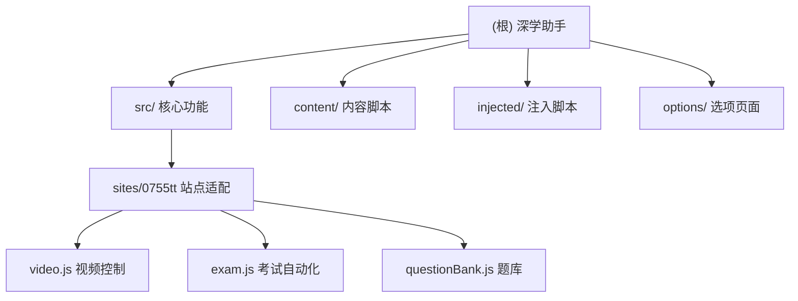

# 深学助手 (DeepLearn Assistant)

## 变更记录 (Changelog)

### 2025年09月05日 - v2.1 稳定性优化版本
- 🛠️ **错误处理增强**: 修复标签页切换竞态条件错误处理
- 🛠️ **播放策略优化**: 修复视频播放Promise未处理拒绝问题，优雅处理浏览器自动播放策略限制
- 🛠️ **资源管理**: 修复扩展图标设置失败的错误处理，增强扩展更新时的稳定性
- 📝 **日志优化**: 减少不必要的错误日志，改善开发者体验
- 🔧 **代码质量**: 遵循KISS和DRY原则，增强异步操作的鲁棒性

### 2025年09月05日 8:18:15 - 项目初始化
- 创建项目AI上下文文档
- 分析项目架构和模块结构
- 建立模块索引和文档框架

---

## 项目愿景

深学助手是一个智能浏览器扩展，专为在线学习平台设计，能够自动识别课程页面，完成视频播放与章节测试，解放用户时间。项目采用模块化架构，支持多平台扩展，目前主要针对0755TT学习平台进行优化。

## 架构总览

本项目基于Chrome扩展API v3构建，采用分层架构设计：

- **扩展核心层**: 背景脚本、选项页面、清单文件
- **功能抽象层**: 工具函数、站点注册器、题库管理
- **站点适配层**: 针对具体学习平台的自动化逻辑  
- **内容注入层**: 内容脚本和页面注入脚本

### 模块结构图

## 模块索引

| 模块路径 | 模块名称 | 类型 | 主要职责 | 入口文件 |
|---------|---------|------|---------|---------|
| `.` | 根模块 | browser_extension_root | 扩展基础配置和后台服务 | `manifest.json`, `background.js` |
| `src/` | 核心功能模块 | javascript_library | 工具函数、注册器、题库管理 | `util.js`, `registry.js` |
| `src/sites/0755tt/` | 0755TT站点适配模块 | site_adapter | 视频和考试自动化 | `index.js` |
| `content/` | 内容脚本加载器 | content_script | 站点检测和模块加载 | `loader.js` |
| `injected/` | 页面注入脚本 | injected_script | 深度页面控制 | `video-agent.js` |
| `options/` | 扩展选项页面 | extension_options | 用户配置界面 | `options.html` |

## 运行与开发

### 安装方式
1. 打开Chrome浏览器扩展管理页面 `chrome://extensions/`
2. 开启"开发者模式"
3. 点击"加载已解压的扩展程序"，选择项目根目录

### 配置使用
1. 安装后点击扩展图标或右键选择"选项"
2. 在选项页面中启用目标站点（目前支持www.0755tt.com）
3. 访问支持的学习平台，扩展将自动识别并启动相应功能

### 开发调试
- 查看控制台日志：所有操作都有详细的`[深学助手]`前缀日志
- 修改代码后需要在扩展管理页面点击"重新加载"
- 使用Chrome开发者工具检查内容脚本和页面交互

## 测试策略

目前项目缺少自动化测试框架，主要依赖手动测试：

### 测试场景
1. **扩展安装测试**: 验证扩展正常加载和配置保存
2. **站点识别测试**: 访问目标站点验证模块正确加载
3. **视频自动化测试**: 测试视频播放、中途弹题处理、切换逻辑
4. **考试自动化测试**: 验证题库匹配、答题逻辑、提交流程

### 建议改进
- 引入Jest等测试框架进行单元测试
- 添加E2E测试验证完整用户流程
- 建立CI/CD管道确保代码质量

## 编码规范

### JavaScript规范
- 使用ES6+语法和模块化设计
- 统一使用`[深学助手]`前缀进行日志输出
- 采用IIFE模式避免全局命名空间污染
- 通过`window.DeepLearn`命名空间组织代码结构

### 文件组织
- 核心功能放在`src/`目录
- 站点特定代码放在`src/sites/{域名}/`目录
- 内容脚本和注入脚本分别放在`content/`和`injected/`目录
- 配置和UI相关文件放在根目录或专门目录

### 错误处理
- 所有异步操作都应包含错误处理
- 使用`util.safeExecute`包装可能出错的操作
- 通过`util.log`系列方法进行结构化日志记录

## AI 使用指引

### 代码分析建议
- 重点关注站点适配模块的业务逻辑
- 注意内容脚本和注入脚本的权限差异
- 理解消息传递机制在不同层次间的应用

### 扩展开发建议
- 新增站点支持时遵循现有的注册器模式
- 保持工具函数的通用性和可复用性
- 注意浏览器扩展的安全策略限制

### 维护注意事项
- 题库更新需要同步修改questionBank.js
- 站点页面结构变更需要调整选择器
- Chrome扩展API更新可能需要适配代码